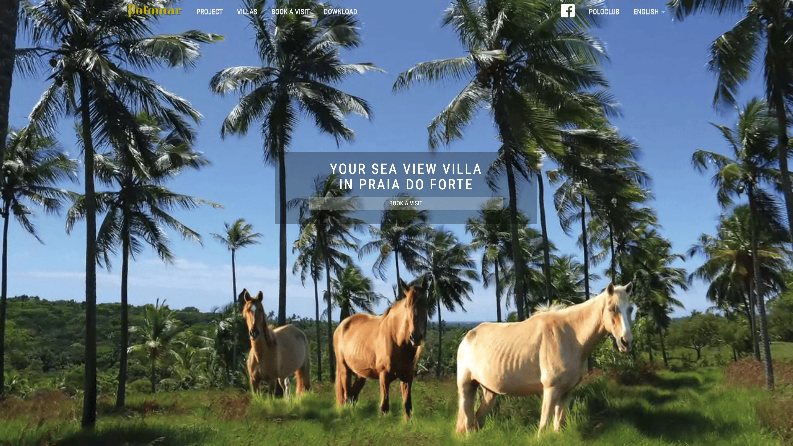
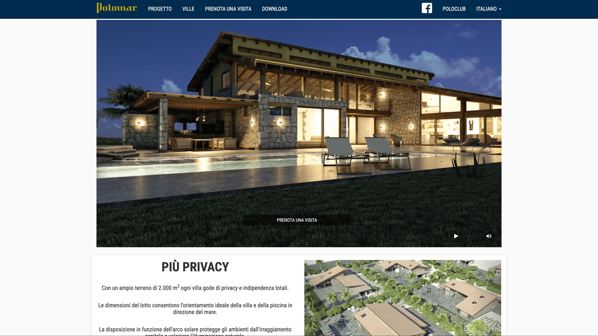
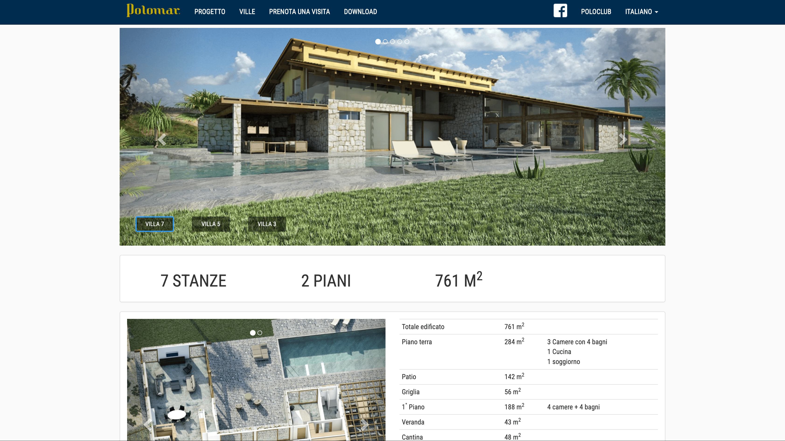

+++
title = "Polomar Real Estate"
date = "2020-01-03"
weight = 10
+++

Sito web per Polomar LTDA, un progetto immobiliare a Praia do Forte, in Brasile. L'applicazione consente di esplorare il progetto residenziale, configurare la propria casa con vista mare, scegliere e opzionare il lotto di terreno e prenotare una visita in loco. Il sito è multilingue (portoghese, inglese, francese, italiano, tedesco e spagnolo) e include una sezione download per la documentazione del progetto.

