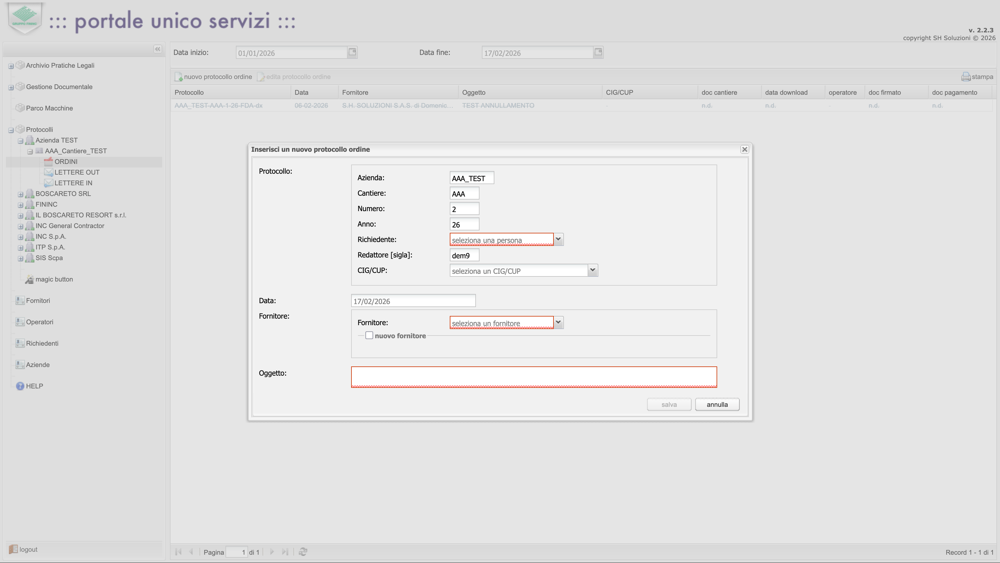
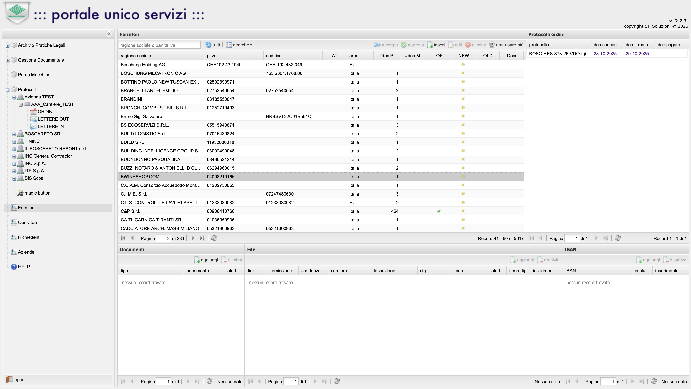
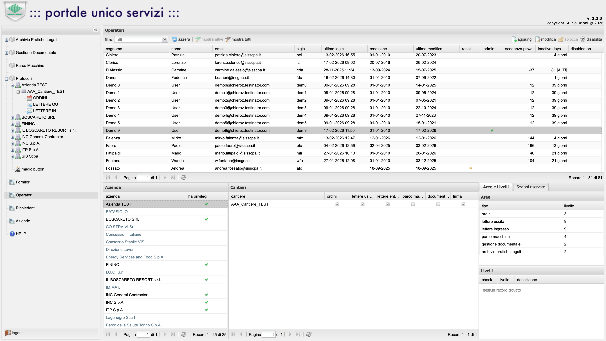

+++
title = "Portale Unico"
date = "2020-01-03"
weight = 20
+++

Portale gestionale enterprise che unifica quattro moduli operativi: gestione protocolli e documentazione, archivio pratiche legali, repository documentale e gestione parco macchine. L'applicazione gestisce flussi di lavoro complessi con approvazioni multilivello, permessi per modulo e filtri per sede/cantiere. Sviluppato in PHP 8.3 con frontend ExtJS, database MySQL e storage su AWS S3. Include validazioni specifiche per il contesto italiano (partita IVA, codice fiscale, IBAN, codici CIG e CUP).

