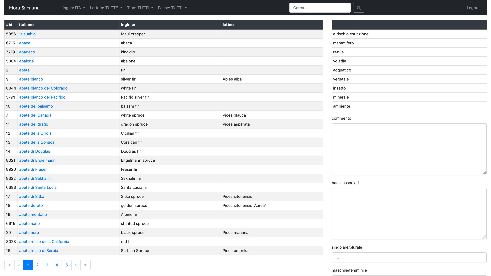
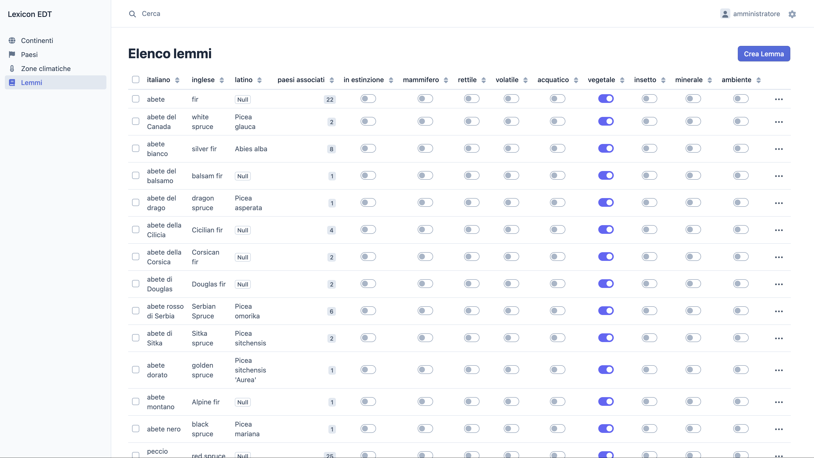
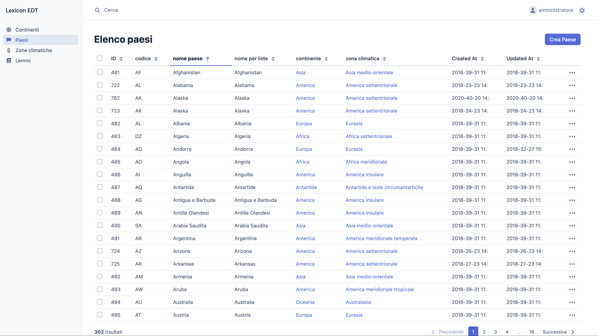

+++
title = "Lexicon (dizionario online)"
date = "2020-01-03"
weight = 30
+++

Dizionario online di flora e fauna con classificazione tassonomica e dati geografici. L'applicazione gestisce lemmi trilingue (italiano, inglese, latino) con filtri per lingua, lettera iniziale, tipologia (mammiferi, rettili, uccelli, specie acquatiche, piante) e paese di origine. Include un pannello di amministrazione per la gestione dei contenuti e delle entità geografiche (continenti, paesi, zone climatiche). Sviluppato in Symfony 6.4 con Doctrine ORM, EasyAdmin e frontend Bootstrap.

